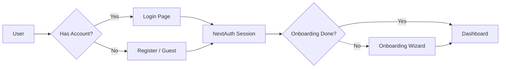
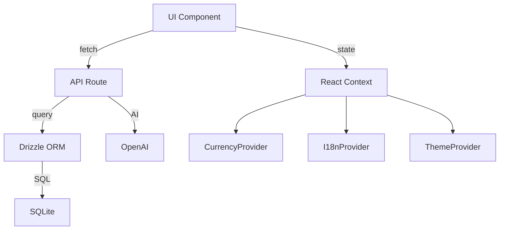

# 🏗️ Monev — Architecture

## Tech Stack

| Layer | Technology | Version |
|-------|------------|---------|
| **Framework** | Next.js | 16 |
| **UI Library** | React | 19 |
| **Language** | TypeScript | 5.x |
| **Styling** | Tailwind CSS | 4 |
| **Animation** | Framer Motion | — |
| **Icons** | Lucide React | — |
| **Database** | SQLite | — |
| **ORM** | Drizzle ORM | — |
| **Auth** | NextAuth (Auth.js) | v5 |
| **AI** | OpenAI SDK | — |
| **Testing** | Vitest | — |
| **Mobile** | Capacitor | — |
| **Font** | Plus Jakarta Sans | Google Fonts |

---

## Folder Structure

```
monev/
├── android/                     # Capacitor Android project
├── docs/                        # 📄 Dokumentasi (file ini)
├── public/                      # Static assets
│   ├── icon.svg                 # App icon (SVG)
│   ├── icon-192.png             # PWA icon 192px
│   ├── icon-512.png             # PWA icon 512px
│   ├── manifest.json            # PWA manifest
│   └── push-sw.js               # Service Worker (push + offline)
├── scripts/                     # Utility scripts
│   ├── generate-icons.cjs       # Generate PWA icon PNGs
│   └── seed-coupons.ts          # Seed coupon data
├── src/
│   ├── app/                     # Next.js App Router
│   │   ├── (protected)/         # Auth-required pages
│   │   │   ├── analytics/       #   → Charts, heatmaps, trends
│   │   │   ├── bills/           #   → Bill tracking
│   │   │   ├── budgets/         #   → Budget management
│   │   │   ├── chat/            #   → AI assistant
│   │   │   ├── dashboard/       #   → Main dashboard
│   │   │   ├── fitur/           #   → Feature hub + upgrade
│   │   │   ├── investments/     #   → Portfolio tracking
│   │   │   ├── profile/         #   → Settings & preferences
│   │   │   ├── savings/         #   → Savings goals
│   │   │   ├── transactions/    #   → Transaction history
│   │   │   └── layout.tsx       #   → Protected layout wrapper
│   │   ├── api/                 # API Routes (31 endpoints)
│   │   │   ├── ai/              #   → AI categorization
│   │   │   ├── analytics/       #   → Analytics data
│   │   │   ├── auth/            #   → NextAuth + register
│   │   │   ├── bills/           #   → Bills CRUD
│   │   │   ├── budgets/         #   → Budgets CRUD
│   │   │   ├── categories/      #   → Category list
│   │   │   ├── chat/            #   → AI chat (streaming)
│   │   │   ├── coupons/         #   → Coupon validation
│   │   │   ├── cron/            #   → Cron jobs
│   │   │   ├── goals/           #   → Goals CRUD
│   │   │   ├── investments/     #   → Investments CRUD
│   │   │   ├── ping/            #   → Health check
│   │   │   ├── push/            #   → Push notifications
│   │   │   ├── stats/           #   → Quick stats
│   │   │   ├── subscriptions/   #   → Subscription detection
│   │   │   ├── transactions/    #   → Transactions CRUD + OCR + voice + export
│   │   │   └── transfer/        #   → Transfers
│   │   ├── login/               # Login page
│   │   ├── register/            # Register page
│   │   ├── forgot-password/     # Forgot password
│   │   ├── onboarding/          # First-time setup wizard
│   │   ├── ClientLayout.tsx     # Client wrapper (providers, nav, plugins)
│   │   ├── globals.css          # Global styles + safe area
│   │   ├── layout.tsx           # Root layout (SEO, fonts, viewport)
│   │   └── page.tsx             # Landing / redirect
│   ├── backend/
│   │   └── db/
│   │       ├── schema.ts        # Drizzle schema (13 tables)
│   │       ├── operations.ts    # DB operations (queries, mutations)
│   │       └── index.ts         # DB connection
│   ├── components/              # Shared/infra components
│   │   ├── ErrorBoundary.tsx    #   → Global error handler
│   │   ├── NativeNotificationService.tsx
│   │   ├── NotificationListenerService.tsx
│   │   ├── Providers.tsx        #   → React Query + Session
│   │   ├── QueryProvider.tsx    #   → TanStack Query setup
│   │   └── SecurityProvider.tsx #   → PIN lock screen
│   ├── frontend/
│   │   ├── components/          # UI components (23 files)
│   │   │   ├── AddTransactionSheet.tsx  # Bottom sheet add tx
│   │   │   ├── BottomNav.tsx            # Bottom navigation
│   │   │   ├── BudgetForms.tsx          # Budget CRUD forms
│   │   │   ├── EditTransactionForm.tsx  # Edit tx form
│   │   │   ├── EmptyState.tsx           # Empty state illustrations
│   │   │   ├── InfiniteScrollList.tsx   # Pagination wrapper
│   │   │   ├── LoadingSkeleton.tsx       # Skeleton loaders
│   │   │   ├── PullToRefresh.tsx        # Pull-to-refresh
│   │   │   ├── SmartInput.tsx           # NL transaction input
│   │   │   ├── Toast.tsx                # Toast notifications
│   │   │   ├── TransactionItem.tsx      # Single tx row
│   │   │   ├── TransferModal.tsx        # Transfer modal
│   │   │   └── ...
│   │   ├── hooks/
│   │   │   └── useWebPush.ts    # Push subscription hook
│   │   └── lib/
│   │       ├── currency-context.tsx  # CurrencyProvider
│   │       ├── i18n-context.tsx      # I18nProvider (id/en)
│   │       ├── hero-theme.tsx        # Hero gradient theme
│   │       ├── theme-context.tsx     # Dark/light theme
│   │       ├── utils.ts             # cn() + formatCurrency()
│   │       └── utils.test.ts        # Unit tests
│   ├── lib/
│   │   ├── rate-limit.ts        # API rate limiter
│   │   ├── rate-limit.test.ts   # Rate limit tests
│   │   └── tier-gate.ts         # Tier permission checks
│   ├── auth.ts                  # NextAuth setup
│   ├── auth.config.ts           # Auth routes config
│   └── middleware.ts            # Auth middleware
├── capacitor.config.ts          # Capacitor config
├── vitest.config.ts             # Vitest config
├── drizzle.config.ts            # Drizzle migration config
├── package.json                 # Dependencies + scripts
└── tsconfig.json                # TypeScript config
```

---

## Architecture Patterns

### 1. App Router (Next.js)
- **Route Groups**: `(protected)` untuk halaman yang butuh auth
- **API Routes**: `app/api/` dengan file `route.ts`
- **Layouts**: Nested layout system (`layout.tsx`)

### 2. Authentication Flow


### 3. Data Flow


### 4. Provider Hierarchy
```
<Providers>              (QueryClient + SessionProvider)
  <HeroThemeProvider>     (Gradient theme)
    <ThemeProvider>        (Dark/light mode)
      <CurrencyProvider>  (Currency formatting)
        <I18nProvider>    (Translations)
          <ToastProvider> (Toast notifications)
            <ErrorBoundary>
              {children}
            </ErrorBoundary>
```

### 5. Security
- **Auth Middleware**: Semua `/api/*` dan `/(protected)/*` dilindungi NextAuth
- **PIN Lock**: `SecurityProvider` cek PIN sebelum tampilkan konten
- **Tier Gate**: `tier-gate.ts` check fitur berdasar subscription tier
- **Rate Limit**: `rate-limit.ts` throttle API per IP

---

## Key Components

| Component | Fungsi |
|-----------|--------|
| `ClientLayout` | Provider wrapper + plugin init + nav |
| `BottomNav` | Bottom tab navigation dengan FAB |
| `AddTransactionSheet` | Bottom sheet untuk input transaksi |
| `SmartInput` | Natural language transaction input |
| `SecurityProvider` | PIN lock screen |
| `ErrorBoundary` | Global error handler |
| `Toast` | Toast notification system |
| `PullToRefresh` | Pull-to-refresh gesture |
| `LoadingSkeleton` | Loading skeletons |
| `EmptyState` | Empty data illustrations |
