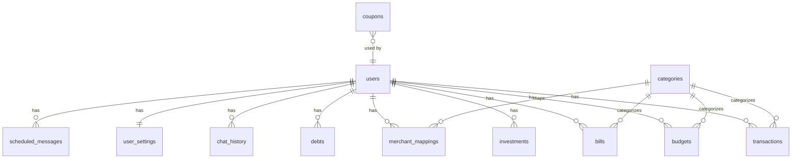

# 🗄️ Monev — Database Schema

Database: **SQLite** via **Drizzle ORM**  
File: `sqlite.db`  
Schema: `src/backend/db/schema.ts`

---

## Tables Overview

| # | Table | Deskripsi | Relasi |
|---|-------|-----------|--------|
| 1 | `categories` | Kategori transaksi (global) | — |
| 2 | `users` | Data user | — |
| 3 | `transactions` | Semua transaksi keuangan | → users, categories |
| 4 | `budgets` | Anggaran per kategori/periode | → users, categories |
| 5 | `goals` | Target tabungan | → users |
| 6 | `merchant_mappings` | Mapping merchant → kategori (AI learning) | → users, categories |
| 7 | `user_settings` | Pengaturan user | → users, goals |
| 8 | `debts` | Hutang/piutang | → users |
| 9 | `scheduled_messages` | Pesan terjadwal (reminder) | → users |
| 10 | `bills` | Tagihan berulang | → users, categories |
| 11 | `chat_history` | Riwayat chat AI | → users |
| 12 | `investments` | Aset investasi | → users |
| 13 | `coupons` | Kupon aktivasi tier | → users |

---

## Table Details

### 1. `categories`
Kategori transaksi — global (shared across all users).

| Column | Type | Constraint | Deskripsi |
|--------|------|------------|-----------|
| `id` | INTEGER | PK, autoincrement | — |
| `name` | TEXT | NOT NULL | Nama kategori (e.g. "Makanan") |
| `icon` | TEXT | NOT NULL, default "Tag" | Nama icon Lucide |
| `color` | TEXT | NOT NULL, default "#6366f1" | Warna hex |
| `type` | TEXT | enum: income/expense/both | Tipe kategori |

---

### 2. `users`
Data user termasuk auth info dan tier.

| Column | Type | Constraint | Deskripsi |
|--------|------|------------|-----------|
| `id` | INTEGER | PK, autoincrement | — |
| `telegram_id` | INTEGER | UNIQUE, nullable | ID Telegram (optional) |
| `email` | TEXT | UNIQUE, nullable | Email login |
| `name` | TEXT | nullable | Nama display |
| `password_hash` | TEXT | nullable | Bcrypt hash |
| `is_guest` | BOOLEAN | default false | Akun guest? |
| `tier` | TEXT | enum: hemat/kaya/sultan, default "hemat" | Subscription tier |
| `tier_expires_at` | TIMESTAMP | nullable | Kapan tier expired |
| `created_at` | TIMESTAMP | NOT NULL | — |

---

### 3. `transactions`
Transaksi keuangan — inti dari aplikasi.

| Column | Type | Constraint | Deskripsi |
|--------|------|------------|-----------|
| `id` | INTEGER | PK, autoincrement | — |
| `user_id` | INTEGER | FK → users, NOT NULL | — |
| `amount` | REAL | NOT NULL | Jumlah uang |
| `type` | TEXT | enum: income/expense, NOT NULL | Pemasukan/pengeluaran |
| `category_id` | INTEGER | FK → categories | Kategori |
| `description` | TEXT | nullable | Deskripsi transaksi |
| `merchant` | TEXT | nullable | Nama merchant/toko |
| `notes` | TEXT | nullable | Catatan tambahan |
| `transaction_date` | TIMESTAMP | NOT NULL | Tanggal transaksi |
| `source` | TEXT | enum: manual/telegram/api/ocr | Sumber input |
| `is_recurring` | BOOLEAN | default false | Transaksi berulang? |
| `created_at` | TIMESTAMP | NOT NULL | — |

---

### 4. `budgets`
Anggaran per kategori.

| Column | Type | Constraint | Deskripsi |
|--------|------|------------|-----------|
| `id` | INTEGER | PK, autoincrement | — |
| `user_id` | INTEGER | FK → users, NOT NULL | — |
| `category_id` | INTEGER | FK → categories | Kategori budget |
| `name` | TEXT | NOT NULL | Nama budget |
| `amount` | REAL | NOT NULL | Jumlah budget |
| `spent` | REAL | default 0 | Sudah dihabiskan |
| `period` | TEXT | enum: monthly/weekly/yearly | Periode |
| `start_date` | TIMESTAMP | — | Tanggal mulai |
| `end_date` | TIMESTAMP | — | Tanggal berakhir |
| `icon` | TEXT | default "Target" | Nama icon |
| `color` | TEXT | default "#3b82f6" | Warna hex |
| `created_at` | TIMESTAMP | NOT NULL | — |

---

### 5. `goals` (di dalam budgets table, field role = goal)
Target tabungan — digunakan di halaman Savings.

---

### 6. `merchant_mappings`
AI learning: mapping nama merchant ke kategori.

| Column | Type | Constraint | Deskripsi |
|--------|------|------------|-----------|
| `id` | INTEGER | PK | — |
| `user_id` | INTEGER | FK → users | — |
| `merchant_name` | TEXT | NOT NULL | Nama merchant |
| `category_id` | INTEGER | FK → categories | Kategori yang di-map |
| `confidence` | REAL | default 1 | Confidence score |
| `created_at` | TIMESTAMP | — | — |

---

### 7. `user_settings`
Pengaturan per user.

| Column | Type | Constraint | Deskripsi |
|--------|------|------------|-----------|
| `id` | INTEGER | PK | — |
| `user_id` | INTEGER | FK → users, UNIQUE | — |
| `hourly_rate` | REAL | default 50000 | Untuk kalkulasi "waktu kerja" |
| `primary_goal_id` | INTEGER | FK → goals | Goal utama di dashboard |
| `security_pin` | TEXT | nullable | PIN keamanan |
| `is_app_lock_enabled` | BOOLEAN | default false | Kunci aplikasi aktif? |
| `hide_balance` | BOOLEAN | default false | Sembunyikan saldo? |
| `notifications_enabled` | BOOLEAN | default true | Notifikasi aktif? |
| `has_completed_onboarding` | BOOLEAN | default false | Onboarding selesai? |
| `updated_at` | TIMESTAMP | — | — |

---

### 8. `debts`
Hutang/piutang tracking.

| Column | Type | Constraint | Deskripsi |
|--------|------|------------|-----------|
| `id` | INTEGER | PK | — |
| `user_id` | INTEGER | FK → users | — |
| `debtor_name` | TEXT | NOT NULL | Nama orang |
| `amount` | REAL | NOT NULL | Jumlah |
| `description` | TEXT | nullable | Keterangan |
| `due_date` | TIMESTAMP | nullable | Jatuh tempo |
| `status` | TEXT | enum: unpaid/paid | Status |
| `created_at` | TIMESTAMP | — | — |

---

### 9. `scheduled_messages`
Pesan/reminder terjadwal.

| Column | Type | Constraint | Deskripsi |
|--------|------|------------|-----------|
| `id` | INTEGER | PK | — |
| `user_id` | INTEGER | FK → users | — |
| `message` | TEXT | NOT NULL | Isi pesan |
| `scheduled_at` | TIMESTAMP | NOT NULL | Kapan dikirim |
| `status` | TEXT | enum: pending/sent/failed | Status |
| `type` | TEXT | enum: stock_opname/reminder/other | Tipe |
| `created_at` | TIMESTAMP | — | — |

---

### 10. `bills`
Tagihan berulang.

| Column | Type | Constraint | Deskripsi |
|--------|------|------------|-----------|
| `id` | INTEGER | PK | — |
| `user_id` | INTEGER | FK → users | — |
| `name` | TEXT | NOT NULL | Nama tagihan |
| `amount` | REAL | NOT NULL | Jumlah |
| `category_id` | INTEGER | FK → categories | Kategori |
| `due_date` | INTEGER | default 1 | Tanggal jatuh tempo (1-31) |
| `frequency` | TEXT | enum: monthly/weekly/yearly | Frekuensi |
| `is_paid` | BOOLEAN | default false | Sudah dibayar bulan ini? |
| `last_paid_at` | TIMESTAMP | nullable | Terakhir dibayar |
| `icon` | TEXT | default "Receipt" | — |
| `color` | TEXT | default "#6366f1" | — |
| `is_active` | BOOLEAN | default true | Masih aktif? |
| `notes` | TEXT | nullable | Catatan |
| `created_at` | TIMESTAMP | — | — |

---

### 11. `chat_history`
Riwayat percakapan dengan AI.

| Column | Type | Constraint | Deskripsi |
|--------|------|------------|-----------|
| `id` | INTEGER | PK | — |
| `user_id` | INTEGER | FK → users | — |
| `role` | TEXT | enum: user/assistant | Siapa yang bicara |
| `content` | TEXT | NOT NULL | Isi pesan |
| `created_at` | TIMESTAMP | — | — |

---

### 12. `investments`
Portfolio investasi.

| Column | Type | Constraint | Deskripsi |
|--------|------|------------|-----------|
| `id` | INTEGER | PK | — |
| `user_id` | INTEGER | FK → users | — |
| `name` | TEXT | NOT NULL | Nama aset (e.g. "BBCA") |
| `type` | TEXT | enum: stock/crypto/mutual_fund/gold/bond/other | Jenis |
| `quantity` | REAL | NOT NULL | Jumlah unit/lot |
| `avg_buy_price` | REAL | NOT NULL | Harga beli rata-rata |
| `current_price` | REAL | NOT NULL | Harga saat ini |
| `platform` | TEXT | nullable | Platform (Bibit, Ajaib, dll) |
| `icon` | TEXT | default "TrendingUp" | — |
| `color` | TEXT | default "#10b981" | — |
| `notes` | TEXT | nullable | Catatan |
| `created_at` | TIMESTAMP | — | — |
| `updated_at` | TIMESTAMP | — | — |

---

### 13. `coupons`
Kupon untuk aktivasi subscription tier.

| Column | Type | Constraint | Deskripsi |
|--------|------|------------|-----------|
| `id` | INTEGER | PK | — |
| `code` | TEXT | UNIQUE, NOT NULL | Kode kupon |
| `tier` | TEXT | enum: kaya/sultan | Tier yang di-unlock |
| `is_used` | BOOLEAN | default false | Sudah dipakai? |
| `used_by` | INTEGER | FK → users | User yang memakai |
| `used_at` | TIMESTAMP | nullable | Kapan dipakai |
| `expires_at` | TIMESTAMP | nullable | Kapan expired |
| `created_at` | TIMESTAMP | — | — |

---

## Entity Relationship

